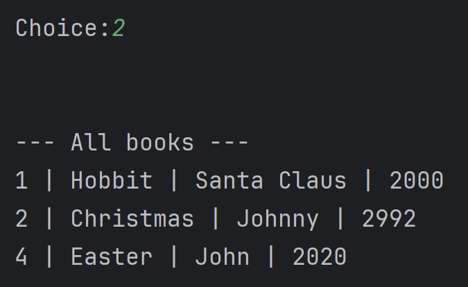

# Record Management System

Project – simple console app in **C++23** with **CSV persistence**.

## Features
* Add / update / delete book records  
* Search by ID  
* List all books (sorted or unsorted)  
* Export current database snapshot to another CSV  

## Build & Run (CLion / CMake)
```bash
mkdir build && cd build
cmake ..
cmake --build .
./RecordManagementSystem   # on Windows: RecordManagementSystem.exe
```

## Menu


## Adding book


## Listing all books


## Searching by ID


## Sorting by ID


## Exporting as csv

